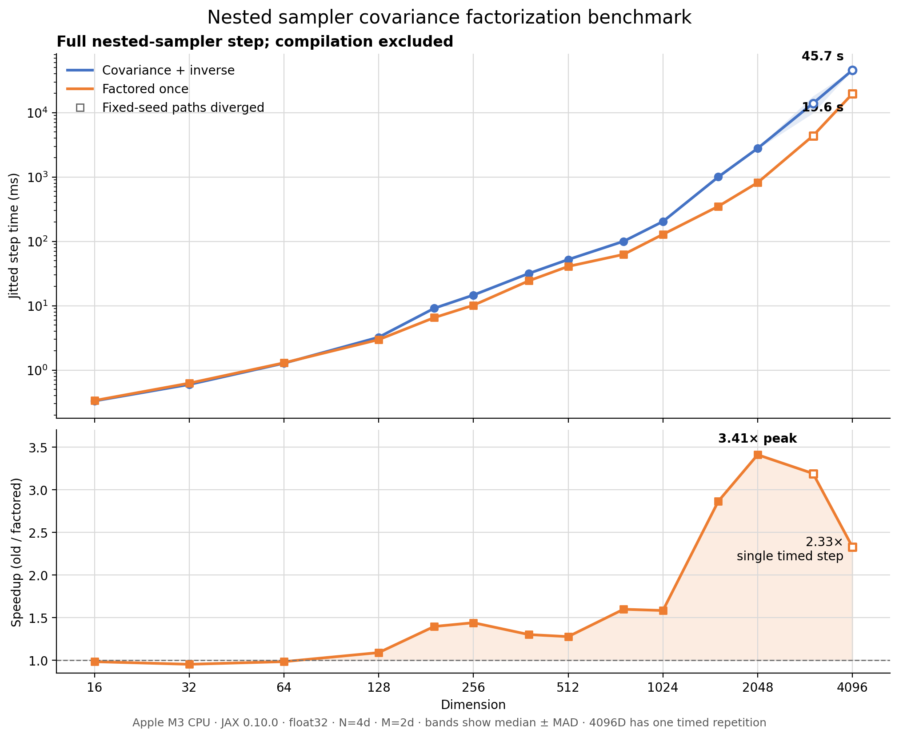

# Factoring the nested-sampler covariance once

The covariance-shaped direction in nested slice sampling can be generated from
one Cholesky factor of the live-point covariance. This removes an explicit matrix
inverse and makes the intended once-per-outer-step geometry update explicit in
the source.

The implementation is in [`blackjax/ns/nss.py`](blackjax/ns/nss.py). The
benchmark data and its reproducible Matplotlib plot are under [`benchmarks/`](benchmarks/).



## Original direction construction

Let the live-point covariance be a positive-definite matrix

\[
C = L L^\mathsf{T},
\]

where \(L\) is its lower-triangular Cholesky factor. The original implementation
sampled

\[
y \sim \mathcal{N}(0, C)
\]

and normalized the result to Mahalanobis norm 2:

\[
d = \frac{2y}{\sqrt{y^\mathsf{T} C^{-1} y}}.
\]

With JAX's default `jax.random.multivariate_normal(..., method="cholesky")`, the
draw is constructed by sampling \(z \sim \mathcal{N}(0, I)\) and setting
\(y=Lz\). The original direction therefore required both a Cholesky
factorization and an explicit inverse of the same covariance.

## Equivalent factored construction

Because

\[
C^{-1} = L^{-\mathsf{T}}L^{-1},
\]

the normalization term simplifies in exact arithmetic:

\[
\begin{aligned}
y^\mathsf{T}C^{-1}y
&= (Lz)^\mathsf{T}L^{-\mathsf{T}}L^{-1}(Lz) \\
&= z^\mathsf{T}z.
\end{aligned}
\]

Consequently,

\[
d = \frac{2Lz}{\lVert z\rVert_2}.
\]

The new implementation stores `cov_sqrt = L` when the live-point geometry is
updated, samples a standard-normal vector for each direction, and applies this
formula directly.

This construction has the same direction distribution as the original one:

- \(Lz\) has covariance \(C\);
- the Mahalanobis norm of the result is 2;
- symmetry is preserved because \(z\) and \(-z\) have the same distribution;
- the likelihood constraint, stepping-out procedure, and shrinkage procedure
  are unchanged.

The constrained slice transition kernel and its invariant constrained target
are therefore unchanged in exact arithmetic.

## Work performed per outer nested-sampling step

Let:

- \(N\) be the number of live points;
- \(K\) be the deletion batch size;
- \(M\) be the number of inner slice steps;
- \(d\) be the position dimension.

The explicit factored implementation performs approximately

\[
O(Nd^2) + O(d^3) + O(KMd^2)
\]

work:

1. compute the live covariance in \(O(Nd^2)\);
2. factor it once in \(O(d^3)\);
3. apply the factor to each of the \(KM\) directions in \(O(KMd^2)\).

The factor is an unmapped inner-kernel parameter, so it is shared by the
replacement chains rather than independently factored in each `vmap` lane.

At the source level, the previous direction function requested a Cholesky
factorization and inverse from inside the inner scan. A naive execution would
repeat cubic work for each direction. XLA hoisted much of this loop-invariant
work on the tested CPU backend, so the benchmark did **not** exhibit the full
naive \(O(KMd^3)\) cost. The refactor still guarantees the intended placement
without depending on compiler optimization and eliminates the inverse in the
compiled computation.

## Numerical behavior

Explicit matrix inversion is unnecessary here and can amplify conditioning and
rounding errors. The factored construction normalizes with \(\lVert z\rVert_2\)
instead of evaluating a quadratic form through \(C^{-1}\), which is both simpler
and numerically preferable.

The change does not add covariance jitter. Cholesky factorization still requires
the live covariance to be positive definite, just as JAX's original default
multivariate-normal construction did. Adding diagonal jitter would be a separate
proposal-geometry decision and is intentionally outside this equivalence
refactor.

Fixed-seed outputs need not be bitwise identical. The new formula changes the
floating-point evaluation order, and tiny differences can eventually change a
slice expansion or shrinkage branch. Focused tests verify the factorization,
Mahalanobis norm, direct formula, and end-to-end nested-sampler behavior.

## Benchmark

The checked-in benchmark used:

- Apple M3 CPU;
- JAX 0.10.0 with `float32`;
- one full jitted nested-sampler step, excluding compilation;
- \(N=4d\), \(M=2d\), and \(K=1\);
- the same initial state and keys for both methods;
- alternating method order across timed repetitions.

Times are medians, with median absolute deviation recorded in
[`benchmarks/nss_covariance_scaling.csv`](benchmarks/nss_covariance_scaling.csv).
The 4096-dimensional endpoint has only one timed repetition.

| Dimension | Covariance + inverse | Factored once | Speedup | Fixed-seed paths |
|---:|---:|---:|---:|:---|
| 1024 | 203.4 ms | 128.4 ms | 1.58x | matched |
| 1536 | 1.004 s | 0.350 s | 2.86x | matched |
| 2048 | 2.790 s | 0.818 s | 3.41x | matched |
| 3072 | 13.96 s | 4.38 s | 3.19x | diverged |
| 4096 | 45.73 s | 19.62 s | 2.33x | diverged |

Fixed-seed slice paths matched through 2048 dimensions, with maximum position
differences below \(5.5\times10^{-6}\). At 3072 and 4096 dimensions,
floating-point differences changed some control-flow decisions. Those endpoints
still measure valid sampler executions, but they are not instruction-for-instruction
comparisons. The hollow plot markers identify them.

These timings are backend- and hardware-specific. They establish that the
factor-once formulation produces a substantial high-dimensional CPU speedup;
they should not be treated as a GPU performance claim.

## Reproducing the plot

From the repository root:

```bash
uv run python benchmarks/plot_nss_covariance_scaling.py
```

The script reads the checked-in CSV and regenerates
`benchmarks/nss_covariance_scaling.png`.
